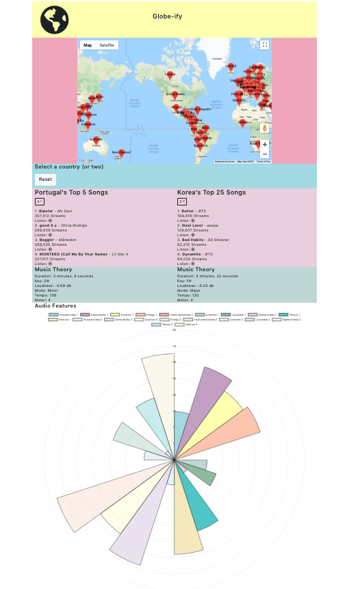

# Globe-ify
A global music analysis application to compare listening preferences across countries.

## Description
Globe-ify allows users to select any country via an interactive map, see that country's top streamed songs for the week, and listen to a snippet of any song. The Music Theory section displays averaged values for song duration, key, loudness, mode, tempo, and meter, based on the currently displayed songs. The Audio Features graph charts out audio analysis averages for acousticness, danceability, duration, energy, instrumentalness, liveness, loudness, speechiness, tempo, and valence. Selecting a second country will display that country's top songs and Music Theory data side by side with the first, and will add that country's audio analysis to the Audio Features graph.

First version created in 2 days for a coding challenge, will be updating from time to time.

## Getting Started

### Prerequisites
- You will need PostgreSQL installed

### Setup
- Fork and clone the repository
- Run `npm install` from the root directory to install project dependencies
- Copy `config.example.js` and rename to `config.js`
- Fill in your Google Maps API key, Spotify ID, Spotify Security code, and Spotify Token (`GET request to '/spotify/auth'` will return a new token if needed`)
- Download chart CSV data from `https://spotifycharts.com/regional/global/weekly/latest` and place in `data/csv`
- Run `npm run seed` to transform and seed the csv data into the PostgreSQL database
- Run `npm run build` to transpile React components
- Run `npm start` to start Express server and serve the app
- Open `http://localhost:3500` in your browser

## Tech Stack
- React
- Bootstrap
- ChartJS
- Express
- PostgreSQL

